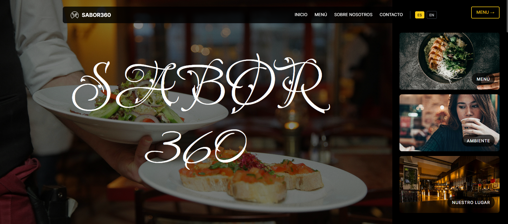

<p align="center">
    
</p>

<h1 align="center">Sabor360</h1>

<p align="center">
    <strong>Experiencia Culinaria 360°</strong><br>
    Sistema de reservaciones y menú interactivo para restaurante
</p>

<p align="center">
    
    
    
    
</p>

## Acerca de Sabor360

Sabor360 es una aplicación web moderna desarrollada con Laravel que ofrece una experiencia culinaria completa. El sistema incluye:

## Instalación y Configuración

### Prerrequisitos

- PHP 8.2 o superior
- Composer
- Node.js y npm
- MySQL
- Servidor web (Apache/Nginx) o usar `php artisan serve`

### Pasos de Instalación

1. **Clonar el repositorio**
   ```bash
   git clone <repository-url>
   cd sabor360
   ```

2. **Instalar dependencias de PHP**
   ```bash
   composer install
   ```

3. **Instalar dependencias de Node.js**
   ```bash
   npm install
   ```

4. **Configurar el archivo de entorno**
   ```bash
   cp .env.example .env
   php artisan key:generate
   ```

5. **Configurar la base de datos**
   - Crear una base de datos MySQL llamada `sabor360`
   - Actualizar las credenciales en `.env`:
   ```env
   DB_DATABASE=sabor360
   DB_USERNAME=tu_usuario
   DB_PASSWORD=tu_contraseña
   ```

6. **Ejecutar migraciones**
   ```bash
   php artisan migrate
   ```

7. **Compilar assets**
   ```bash
   npm run build
   # o para desarrollo:
   npm run dev
   ```

8. **Iniciar el servidor**
   ```bash
   php artisan serve
   ```

## Configuración de Email

Para el sistema de notificaciones, configura tu proveedor de email en `.env`:

### Para desarrollo (Mailtrap)
```env
MAIL_MAILER=smtp
MAIL_HOST=sandbox.smtp.mailtrap.io
MAIL_PORT=2525
MAIL_USERNAME=tu_username
MAIL_PASSWORD=tu_password
MAIL_ENCRYPTION=tls
```

### Para producción (SendGrid)
```env
MAIL_MAILER=smtp
MAIL_HOST=smtp.sendgrid.net
MAIL_PORT=587
MAIL_USERNAME=apikey
MAIL_PASSWORD=tu_sendgrid_api_key
MAIL_ENCRYPTION=tls
```

## Funcionalidades

### Sistema de Reservaciones
- Calendario interactivo personalizado
- Validación de fechas futuras
- Formulario completo con validaciones
- Confirmación por email
- Diseño responsive y elegante

### Menú Interactivo
- Navegación por categorías
- Diseño visual atractivo
- Información detallada de platillos
- Optimizado para móviles

### Panel de Administración
- Gestión de reservaciones
- Control de menú
- Configuración del sistema

## Diseño y UX

- **Tema**: Oscuro elegante con acentos dorados
- **Tipografía**: Inter + Lavishly Yours para títulos
- **Responsive**: Optimizado para todos los dispositivos
- **Animaciones**: Transiciones suaves y efectos hover
- **Accesibilidad**: Diseño inclusivo y navegable

## License

The Laravel framework is open-sourced software licensed under the [MIT license](https://opensource.org/licenses/MIT).
